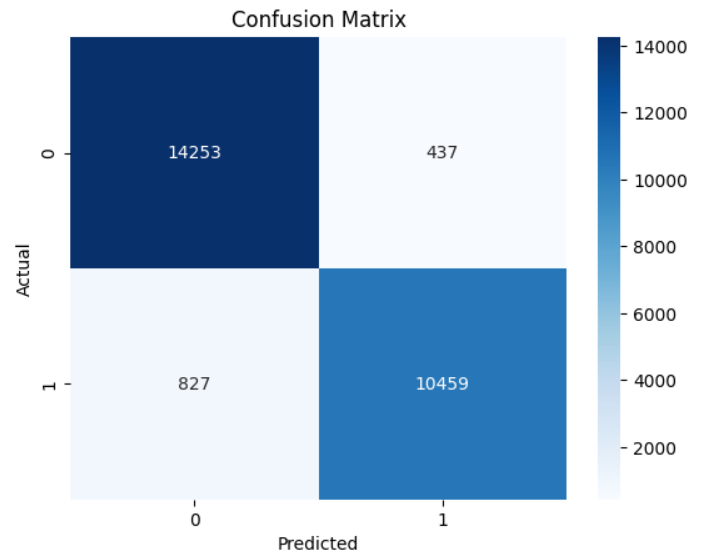
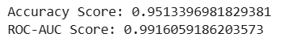
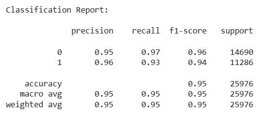

# Airline Customer Satisfaction Prediction

A Machine Learning project that predicts whether an airline customer is **Satisfied** or **Neutral/Dissatisfied** based on travel experience, service quality, and passenger information. The project follows an end-to-end ML pipeline including data preprocessing, feature engineering, model training, evaluation, and prediction.

## Project Overview
Customer satisfaction plays a critical role in the airline industry. Understanding the factors that influence passenger satisfaction enables airlines to improve customer experience, enhance service quality, and increase customer retention.
This project builds a supervised Machine Learning model capable of predicting customer satisfaction using historical airline passenger data.

## Objectives
* Predict customer satisfaction accurately using Machine Learning.
* Perform data preprocessing and feature engineering.
* Compare model performance using evaluation metrics.
* Build a reusable prediction pipeline.
* Demonstrate an end-to-end production-ready ML workflow.

## Project Structure
Airline-customer-satisfaction/
│
├── artifacts/
│
├── notebooks/
│
├── src/
│   ├── data_ingestion.py
│   ├── data_preprocessing.py
│   ├── feature_engineering.py
│   ├── model_training.py
│   ├── model_evaluation.py
│   ├── model_prediction.py
│   └── main.py
│
├── test_predictions.csv
├── requirements.txt
├── README.md
└── .gitignore

## Dataset
The dataset contains airline passenger information including:
* Gender
* Customer Type
* Age
* Travel Type
* Class
* Flight Distance
* Departure Delay
* Arrival Delay
* Inflight Wi-Fi Service
* Online Boarding
* Seat Comfort
* Food & Drink
* Cleanliness
* Inflight Entertainment
* Check-in Service
* Baggage Handling
* Overall Satisfaction

**Target Variable**
Satisfaction

Classes:
* Satisfied
* Neutral or Dissatisfied

## Technologies Used
* Python
* Pandas
* NumPy
* Scikit-learn
* Matplotlib
* Joblib
* VS Code
* Git
* GitHub

## Machine Learning Workflow
Dataset
      │
      ▼
Data Ingestion
      │
      ▼
Data Preprocessing
      │
      ▼
Feature Engineering
      │
      ▼
Train-Test Split
      │
      ▼
Model Training
      │
      ▼
Model Evaluation
      │
      ▼
Prediction

## Model Evaluation
The model is evaluated using multiple performance metrics including:
* Accuracy
* Precision
* Recall
* F1 Score
* ROC-AUC Score
* Confusion Matrix
* Classification Report

Results:
Accuracy : 95.1%

Precision : 96%

Recall : 93%

F1 Score : 94%

ROC-AUC : 0.99%

## 📷 Project Results

### Confusion Matrix

---

### ROC & Accuracy score

---

### Classification Report

---

## 🔮 Future Improvements
* Hyperparameter Tuning
* Model Deployment using Flask or FastAPI
* Interactive Dashboard
* Docker Containerization
* CI/CD Pipeline
* Cloud Deployment (AWS/Azure/GCP)

